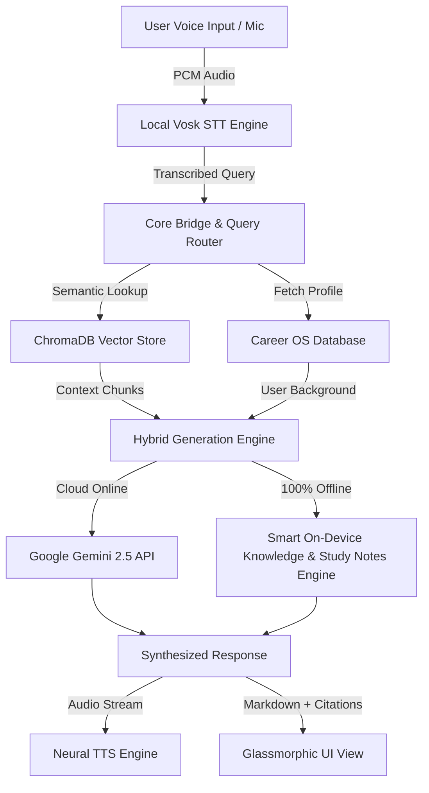

# 🎙️ KnowVox AI — Voice-First Multimodal Career & Document Intelligence Assistant

> **Smart India Hackathon 2026**  
> *Next-Generation Multimodal Voice AI, Autonomous Career Operating System & Factual Document Intelligence.*

---

## 🌟 Overview

**KnowVox AI** is an advanced, production-grade, voice-first intelligent assistant engineered to bridge the gap between spoken conversation, grounded document knowledge, and personalized career roadmaps. Built with high-speed local neural speech processing and hybrid cloud/edge architecture, KnowVox AI operates **100% offline on-device** while seamlessly scaling to cloud LLMs (Gemini 2.5) when online.

---

## ✨ Key Features

### 1. 🎙️ Voice-First Natural Interaction
* **Local Offline Speech-to-Text (STT):** Powered by an embedded Vosk acoustic model with automated phonetic mapping for regional names, technical terms, and spoken number-to-digit conversion.
* **Neural Speech Synthesis (TTS):** Natural, fluid voice responses with automatic stripping of technical disclaimers and smart dash/hyphen pause normalization.
* **Low Latency Audio Pipeline:** Real-time microphone capture with adaptive gain control (AGC) and noise reduction.

### 2. 📄 Factual Grounded RAG (Retrieval-Augmented Generation)
* **Local ChromaDB Vector Database:** On-device vector embeddings and semantic similarity search.
* **Smart Table of Contents (TOC) Filtering:** Automatically filters out indexing noise and drop-cap artifacts to extract real knowledge first.
* **Compact Citation Badges:** Elegant document and page jump linking (e.g., `[P.14 ↗]`) without cluttering the user interface.

### 3. 🎯 Autonomous Career OS Hub
* **Universal Domain Adaptability:** Dynamically tailors guidance, roadmaps, and mock interviews for any profession:
  * 💻 **Software Engineers & B.Tech Students** (System design, algorithms, architecture)
  * 🩺 **Doctors & Medical Professionals** (Emergency clinical diagnosis, stroke protocols)
  * ⚖️ **Corporate Lawyers & Advocates** (M&A deal structuring, indemnity clauses)
  * 🏛️ **Civil Services & UPSC Aspirants** (Constitutional polity, public administration)
  * 🛡️ **Cybersecurity Specialists** (Memory forensics, chain of custody, reverse engineering)

### 4. 📚 Built-in On-Device Study Notes Engine
* Delivers structured, high-yield study cheatsheets completely offline:
  * **Programming & Tech:** Python, Java, DSA, SQL, Web Development (HTML/CSS/JS)
  * **Sciences & Medicine:** Biology (Cell bio, genetics, physiology), Clinical Medicine, Physics, Chemistry
  * **Governance & Law:** Indian Polity, Constitution, and Universal Academic Framework for any discipline.

### 5. 📦 100% Self-Contained Release Binary
* Compiled with PyInstaller into a zero-dependency, single-folder release package (`KnowVox AI.exe`).
* Verified distribution ZIP size of **< 95 MB** (strictly below Google Form / hackathon submission thresholds).

---

## 🏗️ System Architecture



---

## 🚀 Quick Start (Running from Source)

### 1. Prerequisites
* Python 3.10+ (Python 3.12 recommended)
* Git

### 2. Clone the Repository
```bash
git clone https://github.com/HOOGABOOGA1/KnowVox-AI.git
cd KnowVox-AI
```

### 3. Setup Virtual Environment
```bash
python -m venv .venv
# On Windows PowerShell:
.venv\Scripts\Activate.ps1
# On Linux/macOS:
source .venv/bin/activate
```

### 4. Install Dependencies
```bash
pip install -r voicerag/requirements.txt
```

### 5. Launch the Application
```bash
# Launch Standalone Desktop App (with PyWebView UI)
python voicerag/desktop_app.py

# Or run FastAPI Server:
uvicorn voicerag.app.main:app --reload --port 8000
```

---

## 📂 Project Structure

```text
KnowVox-AI/
├── .gitignore
├── README.md
├── career_os.db               # Active Career OS SQLite database
├── voicerag/
│   ├── desktop_app.py         # PyWebView desktop bridge & application runtime
│   ├── knowvox.spec           # PyInstaller release build specification
│   ├── run_diagnostics.py     # System test & diagnostic suite
│   ├── app/
│   │   ├── main.py            # FastAPI API server & endpoints
│   │   ├── core/              # Config & conversation manager
│   │   ├── models/            # Pydantic schemas & data models
│   │   ├── rag/               # Document loader, chunking & ChromaDB vector store
│   │   └── services/          # RAG synthesis, STT (Vosk), TTS (Edge-TTS)
│   └── ui/
│       ├── index.html         # Premium Glassmorphic UI
│       └── assets/            # App icons, sound effects & branding
└── backend/                   # Career OS core services
```

---

## 👥 Team & Acknowledgments

* **Lead Developer:** Ishant ([@HOOGABOOGA1](https://github.com/HOOGABOOGA1))
* **Event:** Smart India Hackathon (SIH 2026)
* **Status:** Round 1 Cleared 🚀